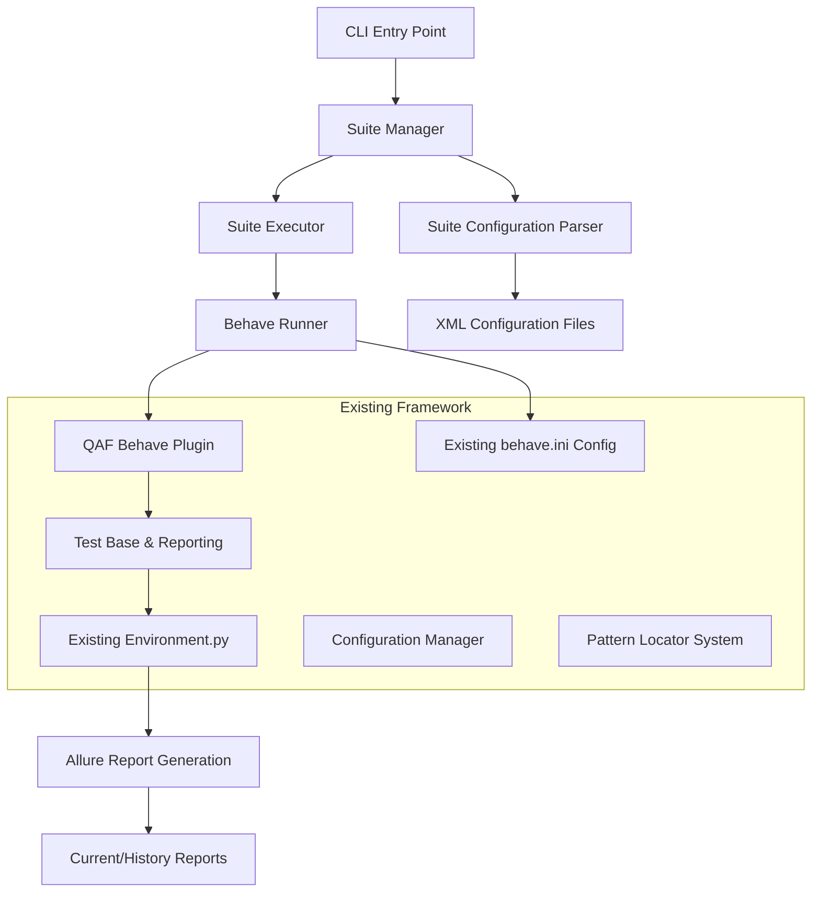

# Design Document

## Overview

The Test Suite Management feature extends the existing QAF-Python framework to support organized execution of test collections, inspired by QMetry's Test Runner system. This design builds upon the current `run_tests.py` implementation and behave integration to provide XML-based suite configuration while fully respecting the existing Allure reporting implementation in `behave.ini` and `tests/environment.py`.

The solution integrates seamlessly with the existing framework architecture, leveraging current components like `qaf_behave_plugin.py`, `configurations_manager.py`, and the established Allure reporting workflow while adding new capabilities for suite management and execution.

## Architecture

### High-Level Architecture



### Component Integration

The design leverages existing framework components:

- **QAF Behave Plugin**: Existing hook system for test lifecycle management
- **Configuration Manager**: Extends current property-based configuration
- **Existing Allure Integration**: Respects current behave.ini formatter and tests/environment.py report generation
- **Test Base**: Utilizes current test context and command logging

## Components and Interfaces

### 1. Suite Configuration System

#### SuiteConfiguration Class
```python
class SuiteConfiguration:
    def __init__(self, name: str, config_path: str)
    def load_xml_config(self) -> dict
    def validate_configuration(self) -> bool
    def get_scenario_paths(self) -> List[str]
    def get_include_tags(self) -> List[str]
    def get_exclude_tags(self) -> List[str]
    def get_execution_config(self) -> ExecutionConfig
```

#### XML Configuration Format
Based on QAF's TestNG-style configuration:
```xml
<suite name="smoke-test-suite">
    <parameters>
        <parameter name="env" value="UAT"/>
        <parameter name="browser" value="chrome"/>
    </parameters>
    <test name="smoke-tests">
        <groups>
            <run>
                <include name="smoke"/>
                <include name="critical"/>
                <exclude name="slow"/>
            </run>
        </groups>
        <classes>
            <class name="features.login"/>
            <class name="features.dashboard"/>
        </classes>
    </test>
</suite>
```

### 2. Suite Manager

#### SuiteManager Class
```python
class SuiteManager:
    def __init__(self, config_manager: ConfigurationsManager)
    def list_suites(self) -> List[str]
    def create_suite(self, config: SuiteConfiguration) -> bool
    def delete_suite(self, suite_name: str) -> bool
    def validate_suite(self, suite_name: str) -> ValidationResult
    def get_suite_details(self, suite_name: str) -> SuiteConfiguration
```

#### SuiteRepository Class
```python
class SuiteRepository:
    def __init__(self, suites_directory: str)
    def save_suite(self, suite: SuiteConfiguration) -> bool
    def load_suite(self, suite_name: str) -> SuiteConfiguration
    def delete_suite(self, suite_name: str) -> bool
    def list_available_suites(self) -> List[str]
```

### 3. Suite Execution Engine

#### SuiteExecutor Class
```python
class SuiteExecutor:
    def __init__(self, suite_config: SuiteConfiguration)
    def execute_suite(self) -> ExecutionResult
    def execute_sequential(self) -> ExecutionResult
    def stop_execution(self) -> bool
```


### 4. Report Integration System

The suite execution must fully respect and preserve the existing Allure reporting implementation:

- **behave.ini Configuration**: Maintains the existing `allure_behave.formatter:AllureFormatter` and `reports/allure-results` output directory
- **tests/environment.py Integration**: Preserves the `after_all` hook that generates both current execution and historical reports
- **No Report Modification**: The suite execution will not interfere with or modify the established report generation workflow

#### ReportIntegrator Class
```python
class ReportIntegrator:
    def __init__(self, existing_config: BehaveConfig)
    def preserve_allure_config(self) -> None
    def ensure_environment_hooks(self) -> None
    def validate_report_directories(self) -> bool
    def integrate_with_existing_workflow(self) -> None
```

#### Existing Report Workflow Preservation
- Current execution reports: `reports/test_reports/{timestamp}/index.html`
- Historical accumulation: `reports/allure-history/`
- Full history report: `reports/full-execution-history.html`
- Allure results directory: `reports/allure-results/`

### 5. Enhanced CLI Interface

#### SuiteRunner Class
```python
class SuiteRunner:
    def __init__(self)
    def run_suite(self, suite_name: str, **kwargs) -> int
    def list_suites(self) -> None
    def create_suite_interactive(self) -> None
    def validate_suite(self, suite_name: str) -> None
```

## Data Models

### SuiteConfiguration Model
```python
@dataclass
class SuiteConfiguration:
    name: str
    description: str
    scenario_paths: List[str]
    include_tags: List[str]
    exclude_tags: List[str]
    execution_config: ExecutionConfig
    environment_params: Dict[str, str]
    reporting_config: ReportConfig
    timeout_config: TimeoutConfig
```

### ExecutionConfig Model
```python
@dataclass
class ExecutionConfig:
    stop_on_failure: bool
    max_retries: int
    timeout_seconds: int
    environment: str
```

### ExecutionResult Model
```python
@dataclass
class ExecutionResult:
    suite_name: str
    total_scenarios: int
    passed: int
    failed: int
    skipped: int
    execution_time: float
    error_details: List[str]
    report_paths: List[str]
```

## Error Handling

### Exception Hierarchy
```python
class SuiteException(Exception): pass
class SuiteConfigurationError(SuiteException): pass
class SuiteExecutionError(SuiteException): pass
class SuiteValidationError(SuiteException): pass
```

### Error Recovery Strategies

1. **Configuration Errors**: Validate XML syntax and provide detailed error messages with line numbers
2. **Missing Feature Files**: Skip missing files and continue execution with warnings
3. **Resource Conflicts**: Ensure proper cleanup and session management

## Testing Strategy

### Unit Testing
- Test suite configuration parsing and validation
- Test error handling and recovery mechanisms
- Test CLI argument parsing and validation

### Integration Testing
- Test end-to-end suite execution workflow
- Test integration with existing QAF behave plugin
- Test reporting system integration
- Test XML configuration file processing

### Performance Testing
- Test memory usage with large test suites
- Test report generation performance

### Compatibility Testing
- Test backward compatibility with existing run_tests.py
- Test integration with current behave.ini configuration
- Test compatibility with existing feature files and step definitions
- Test cross-platform execution (Windows/Linux/Mac)

## Migration Strategy

### Phase 1: Core Suite Management
- Implement XML configuration parsing
- Create suite repository and basic CRUD operations
- Extend existing CLI with suite commands
- Maintain backward compatibility with current run_tests.py

### Phase 2: Execution Engine
- Implement sequential suite execution
- Integrate with existing behave runner
- Add basic reporting enhancements
- Support for tag-based filtering

### Phase 3: Report Integration
- Ensure seamless integration with existing Allure workflow
- Validate behave.ini configuration preservation
- Test environment.py hook integration
- Verify current/history report generation

## Security Considerations

- **Configuration Validation**: Strict XML schema validation to prevent injection attacks
- **Path Traversal Protection**: Validate all file paths to prevent directory traversal
- **Resource Limits**: Implement limits on execution time
- **Sensitive Data Handling**: Ensure environment parameters don't expose credentials in logs

## Performance Optimizations

1. **Lazy Loading**: Load suite configurations only when needed
2. **Caching**: Cache parsed XML configurations for repeated executions
3. **Memory Management**: Implement proper cleanup for suite executions
4. **Report Optimization**: Leverage existing Allure report generation without modification